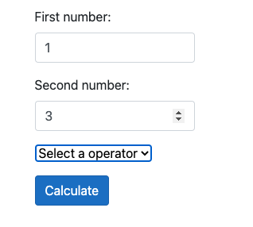
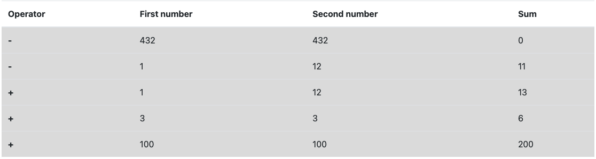

# Inledning

Här kommer mitt slutarbete för kursen Utveckling av molnbaserade applikationer. 
Målet med denna application är att visa att man tagit till sig de kunskaper som denna kurs har erbjudit, och denna uppgift är att skapa en webbapplikation, functions, application insights samt databas som ska köras i Azure.

Länk till beskrivningen av uppgiften vi har fått att göra:
<a href="https://github.com/PGBSNH20/moln-tenta-Spuute/blob/main/Description.md">Beskrivning</a>

## Applikationen i molnet


**Togs bort efter kursexamination**

## Kodstruktur

Denna applikation innehåller följande komponenter:

* Azure Functions
* Azure Cosmos DB
* ASP.NET Core Webbapplikation
* Azure Application Insights
* Dockerfile

## Azure Functions

Projektet innehåller 3st olika Azure functions, en för att addera två tal, en för att subtrahera samt en för att hämta de fem senaste uträkningarna från databasen (uppgiften sa 10, men jag tänkte att 5 räcker då principen är den samma oavsett om man väljer att hämta 5, 7 eller 10). 

### ./Models/Calculate.cs

Detta är modellen som används för att skapa upp objekt att använda i nedanstående functions för att spara och hämta data från databasen. 

### Addition.cs

Det är en HTTP Post mot en CosmosDB
Funktionen tar in två tal från en requestbody och skapar upp en ny instans av Calculate modellen. 
Den gör en additionsuträkning av de tal som kommer från requesten och tilldelar de till den instans av Calculate som skapats och sparar sedan den till databasen. Därefter retuneras en OkObjectResult med uträkningen, detta för att visas i webbapplikationen.

### Subtraction.cs

Detta är en HTTP Post mot en CosmosDB
Funktionen tar in två tal från en requestbody och skapar upp en ny instans av Calculate modellen.
Den gör därefter en subtraktionsuträkning av de tal som kommer från requesten och tilldelar de till den instans av Calculate som skapats och spar slutligen detta till databasen. Det skapas även upp en string variabel som uträkningen sedan sparas till och retuneras i en OkObjectResult.

### Calculation.cs

Detta är en HTTP Get mot en CosmosDB
Denna funktion hämtar data från databasen och sorterar detta fallande baserat på tidpunkt som den sparats, därefter tar den de 5 senaste och retunerar detta i en OkObjectResult.

## ASP.NET Core WebApp

Denna webapp är ganska basic men jag kommer att lista det som jag skapat upp utöver det man får med när man skapar upp ett nytt ASP.NET Core Webapp projekt. 

I detta projekt används följande NuGet paket

* Microsoft.ApplicationInsights.AspNetCore
* RestSharp

### Startup.cs

För att använda ILogger så injeceras den genom konstruktor till pagemodellerna där den används, och för att sätta upp detta så har jag lagt till följande service under ConfigureServices 
```csharp
            services.AddApplicationInsightsTelemetry();
```

Min instrumentationkey ligger under appsettings.json, men bör läggas i Azure KeyVault istället. 


### ./Models/Calculate.cs

Detta är modellen som används för till requestbody samt för att presentera data i applikationen

### ./Pages/calculate.cshtml

Detta är sidan som presenterar user interface:t för kalkylatorn. 
Kalkylatorn är skapad med ett formulär där taghelpers används för att binda input:en från användaren till rätt property i modellen. 
För att välja addition eller subtraktion har jag valt att använda en dropdown meny som har olika värden baserat på om man väljer addition eller subtraktion. 

Det finns en knapp som är av typen submit för att trigga OnPost() 



Eftersom 

### ./Pages/calculate.cshtml.cs

Detta är en pagemodel för calculate.cshtml sidan, och denna innehåller properties för att binda input från formuläret som agerar kalkylator. 
I OnPost metoden finns en ifsats som gör olika anrop till de tidigare nämnda funktionerna baserat på om man har valt addition eller subtraktion, och detta genom de värden som jag tidigare nämnt som finns på dropdown menyn. Väljer man addition blir värdet 1 och subtraktion så blir värdet 2. Skulle man vilja bygga ut kalkykatorn så den även kan använda multiplikation och division så skapar man nya funktioner för det och kan enkelt lägga till dessa i både dropbox samt OnPost. 

För att anropa funktionerna använder jag mig av RestSharp. Vid varje lyckat anrop så loggas detta i form av information till Azure Application Insights, och om det av någon anledning inte skulle lyckas så kommer ett error meddelande att loggas. Detta gäller för både anrop till addition och subtraktion. 

För att använda ILogger så använder jag mig av dependency injection där jag injecerar ILogger genom konstruktorn.

### ./Pages/History.cshtml

Detta är sidan som presenterar data i form av de fem senaste uträkningarna som hämtas från databasen. 
Datan presenteras i en tabell som skapas dynamiskt baserat på antal resultat som hämtas från databasen, och detta görs genom en foreach loop. 



### ./Pages/History.cshtml.cs

Denna pagemodel injecerar ILogger genom konstruktorn och har en property i form av en lista med Calculate modellen. 

OnGet() innehåller ett anrop till funktionen för att hämta data från databasen och spara till ovan nämnda lista. 
Vid lyckad hämtning loggas information om detta till Application Insights och om det av någon anledning inte skulle lyckas så kommer detta loggas i form av ett error tillsammans med ett meddelande. 

## Dockerfile

Det finns en Dockerfile i ASP.NET Core Webbappen och denna används för att bygga ett image som sedan deployas till Azure för att bygga en container som kör applikationen i molnet
